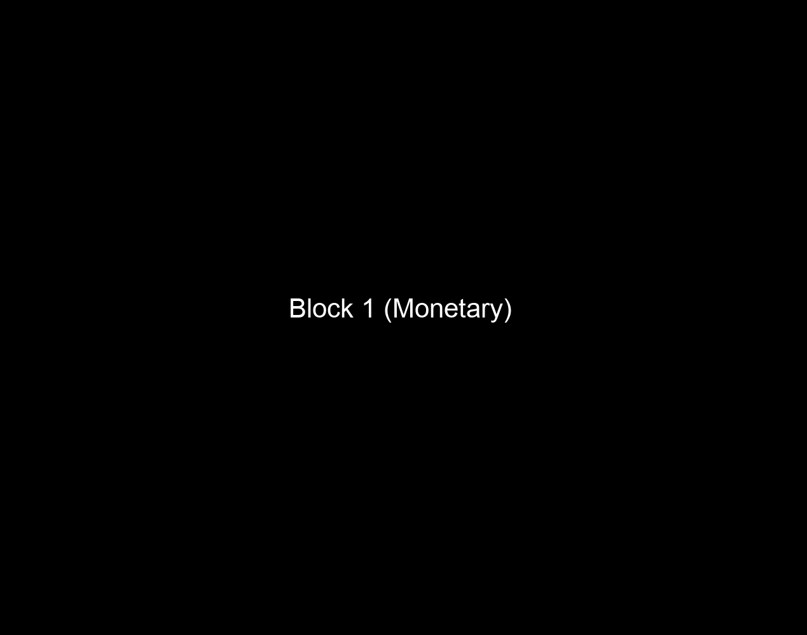

# Medical Decision-Making Task (MDM)

## General description

In this task, there are medical and
monetary decision-making scenarios.

In each iteration of the
monetary task, the user is asked to choose between a guaranteed \$5
payoff (gain) and a lottery of varying probabilities and ambiguity,
in which there are two possible outcomes: \$0 or some positive amount
of \$ up to \$25 (in the discrete amounts shown below). 

In each
iteration of the medical task, the user is asked to imagine the
following scenario: the user has been in a car accident, and as a
result suffered injury of the spinal cord, leading to paralysis from
the waist down. The user is asked to choose between two kinds of
treatment: one treatment is guaranteed to result in slight
improvement, while the other is an experimental treatment that may
either result in no improvement or some positive level of
improvement (possible outcomes below). The experimental treatment
varies in probability of outcomes and possible ambiguity.

## User interface

The task is operated with the following keypresses:

- \[5/%\] to begin a block; 
- \[1/!\] for the left option and \[2/@\] for the right option. 

## Session properties

There are 21 trials per block. There are 4
blocks in a session (this means 84 trials per session).

## Trial properties

### Contingencies

- **Probabilities:** 0.25, 0.5, 0.75
- **Ambiguities:** 0.24, 0.5, 0.74

### Domain payoffs

-   **Monetary:** \$0 (loss only), \$5, \$8, \$12, \$25
-   **Medical**: no effect, slight
  improvement, moderate improvement, major improvement, recovery

### Time involved

- **Duration of choice display:** exactly 6 seconds
- **Duration of response window:** exactly 3.5 seconds
- **Duration of feedback** (after choice is made): 0.5
  seconds
- **Duration of ITI:** 10 seconds for the initial catch trial in
  each box; 6 4-second ITI’s, 8 5-second ITI’s, and 6 6-second
  ITI’s randomly distributed across the rest of the block.

## Example

 